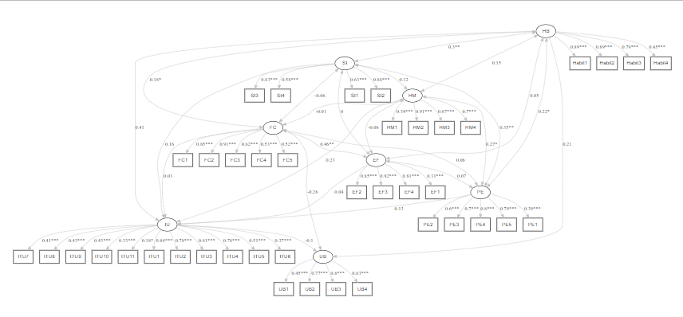
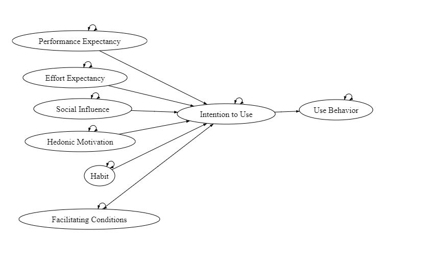
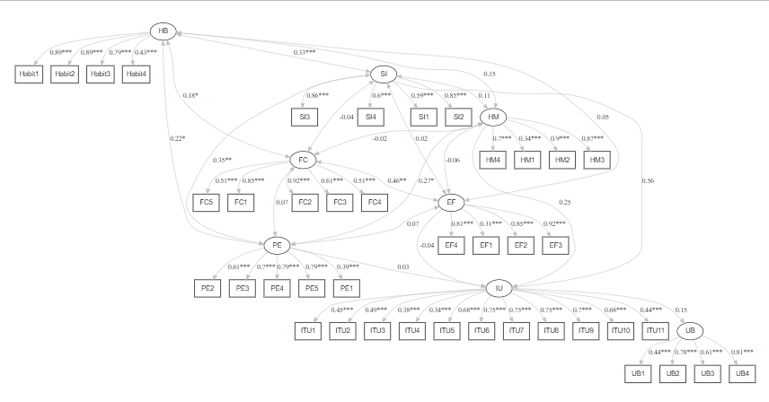

```{r setup, include=FALSE}
knitr::opts_chunk$set(echo = FALSE)
```

## Introduction

The purpose of this research is to compare and evaluate two models of the Unified Theory of Acceptance and Use of Technology 2 (UTAUT2) framework, using structural equation modeling (SEM) techniques. The authors collected data from 170 students enrolled in a business statistics course at the University of Malaya, Malaysia. They tested the data using maximum likelihood and Bayesian approaches. ([@jenatabadi2017]

I analyzed the raw data provided by the authors using STATA and lavaan to run a full structural equation modeling of the questionnaires.

## Literature Review

The Unified Theory of Acceptance and Use of Technology (UTAUT) is a widely used theoretical model for studying technology acceptance and user behavior in various contexts. UTAUT proposes that behavioral intention to use technology is determined by four main constructs: performance expectancy, effort expectancy, social influence, and facilitating conditions. [@venkatesh2003] Several moderators, such as gender, age, experience, and voluntariness of use influence these constructs. The most recent version of UTAUT is UTAUT2, which incorporates additional constructs such as hedonic motivation, price value, and habit. [@venkatesh2012]

## Literature Review

The key constructs of UTAUT2 framework are:

**Performance expectancy:** This degree to which an individual believes using technology will enhance their performance. It includes perceived usefulness, the degree to which technology is perceived to improve task performance, and job relevance.

**Effort expectancy:** This construct refers to the degree of ease associated with using technology. It includes perceived ease of use, which is the degree to which technology is perceived to be easy to use.

## Literature Review

**Social influence:** This refers to the degree to which an individual perceives that important others believe they should use technology. It includes subjective norm, which is the degree to which an individual perceives social pressure to use technology.

**Facilitating conditions:** It includes technical support, which is the degree to which an individual perceives that technical assistance is available when needed, and infrastructure, which is the degree to which an individual perceives that the necessary product is available.

## Literature Review

**Hedonic motivation:** This construct refers to the degree to which an individual perceives that using technology is fun, entertaining, and enjoyable. It includes intrinsic motivation, which is the degree to which an individual is motivated to use technology because they find it enjoyable or satisfying, and enjoyment.

**Habit:** Habit refers to the degree to which an individual has developed a pattern of using technology regularly. It includes habit strength, the degree to which an individual's behavior towards technology is automatic and without conscious thought. [@tamilmani2021]

## UTAUT2 Structural Equation Modelling

The research framework is :

.png)

## Testing the Author's Framework

I tested the original research model using lavaan : [@lavaan]

```{r eval = FALSE, echo=TRUE}
# Specify the model
model1 <- '
   # UTAUT2 Measurement Model
  
   PE =~ PE1+PE2+PE3+PE4+PE5
   EF =~ EF1+EF2+EF3+EF4
   FC =~ FC1+FC2+FC3+FC4+FC5
   HM =~ HM1+HM2+HM3+HM4
   SI =~ SI1+SI2+SI3+SI4
   HB =~ Habit1+Habit2+Habit3+Habit4 
   IU =~ ITU1+ITU2+ITU3+ITU4+ITU5+ITU6+ITU7+ITU8+ITU8+ITU9+ITU10+ITU11
   UB =~ UB1+UB2+UB3+UB4
  
  #UTAUT2 Structural Model
  IU ~ PE+EF+FC+HM+SI+HB
  UB ~ HB+IU+FC
'

# Fitting the model
fit <- cfa(model1, data = Raw_data_to_analyze_SEM)


# Finding the fit summary

summary(fit,fit.measures=TRUE,standardized=TRUE, rsquare=TRUE)
```

## Preliminary Fit

```{r eval=FALSE, echo=TRUE}
lavaan 0.6.15 ended normally after 105 iterations

  Estimator                                         ML
  Optimization method                           NLMINB
  Number of model parameters                       106

  Number of observations                           170

Model Test User Model:
                                                      
  Test statistic                              2281.873
  Degrees of freedom                               755
  P-value (Chi-square)                           0.000

Model Test Baseline Model:

  Test statistic                              4906.262
  Degrees of freedom                               820
  P-value                                        0.000

User Model versus Baseline Model:

  Comparative Fit Index (CFI)                    0.626
  Tucker-Lewis Index (TLI)                       0.594

Loglikelihood and Information Criteria:

  Loglikelihood user model (H0)              -8055.643
  Loglikelihood unrestricted model (H1)      -6914.707
                                                      
  Akaike (AIC)                               16323.287
  Bayesian (BIC)                             16655.682
  Sample-size adjusted Bayesian (SABIC)      16320.048

Root Mean Square Error of Approximation:

  RMSEA                                          0.109
  90 Percent confidence interval - lower         0.104
  90 Percent confidence interval - upper         0.114
  P-value H_0: RMSEA <= 0.050                    0.000
  P-value H_0: RMSEA >= 0.080                    1.000

Standardized Root Mean Square Residual:

  SRMR                                           0.125
```

## Analysis

The comparative fit index (CFI) and Tucker-Lewis Index (TLI) both have values less than 0.70, which is an indicator of a poor model fit. The root mean square error of approximation (RMSEA) of 0.109 with a 90% confidence interval between 0.104 and 0.114 suggests that the model fit is not very good. The standardized root mean square residual (SRMR) of 0.125 is also an indicator of a relatively poor model fit.

In summary, the overall fit of the model is poor, as indicated by the significant chi-square test statistic, low CFI and TLI values, high RMSEA, and high SRMR.

## SEM Path Diagram

The path diagram was built using lavaanplot ([@lavaanPlot]



## Factor Loadings

We can see that the factor loadings for most of the observed variables are above 0.5, indicating a good fit between the observed variables and their corresponding latent variables. The standardized factor loadings for the EF and SI latent variables are relatively low, but still above 0.3.

## Alternative Model

I wanted to test an alternative model where all the latent variables are correlated to the intention to use but not to use behavior. All the latent variables are mediated by intention to use.



## Testing the Modified Model

I tested the UTAUT research model using lavaan :

```{r eval = FALSE, echo=TRUE}
# Specify the model
model2 <- '
   # UTAUT2 Measurement Model
  
   PE =~ PE1+PE2+PE3+PE4+PE5
   EF =~ EF1+EF2+EF3+EF4
   FC =~ FC1+FC2+FC3+FC4+FC5
   HM =~ HM1+HM2+HM3+HM4
   SI =~ SI1+SI2+SI3+SI4
   HB =~ Habit1+Habit2+Habit3+Habit4 
   IU =~ ITU1+ITU2+ITU3+ITU4+ITU5+ITU6+ITU7+ITU8+ITU8+ITU9+ITU10+ITU11
   UB =~ UB1+UB2+UB3+UB4
  
  #UTAUT2 Structural Model
  IU ~ PE+EF+HM+SI
  UB ~ IU
'

# Fitting the model
fit <- cfa(model, data = Raw_data_to_analyze_SEM)


# Finding the fit summary

summary(fit,fit.measures=TRUE,standardized=TRUE, rsquare=TRUE)
```

## Fit

```{r eval=FALSE, echo=TRUE}
lavaan 0.6.15 ended normally after 131 iterations

  Estimator                                         ML
  Optimization method                           NLMINB
  Number of model parameters                       102

  Number of observations                           170

Model Test User Model:
                                                      
  Test statistic                              2263.895
  Degrees of freedom                               759
  P-value (Chi-square)                           0.000

Model Test Baseline Model:

  Test statistic                              4906.262
  Degrees of freedom                               820
  P-value                                        0.000

User Model versus Baseline Model:

  Comparative Fit Index (CFI)                    0.632
  Tucker-Lewis Index (TLI)                       0.602

Loglikelihood and Information Criteria:

  Loglikelihood user model (H0)              -8046.654
  Loglikelihood unrestricted model (H1)      -6914.707
                                                      
  Akaike (AIC)                               16297.309
  Bayesian (BIC)                             16617.160
  Sample-size adjusted Bayesian (SABIC)      16294.192

Root Mean Square Error of Approximation:

  RMSEA                                          0.108
  90 Percent confidence interval - lower         0.103
  90 Percent confidence interval - upper         0.113
  P-value H_0: RMSEA <= 0.050                    0.000
  P-value H_0: RMSEA >= 0.080                    1.000

Standardized Root Mean Square Residual:

  SRMR                                           0.125
```

## Analysis

The comparative fit index (CFI) and Tucker-Lewis Index (TLI) values of 0.632 and 0.602, respectively, are not very high, but are improved as compared to the previous model.

The RMSEA value of 0.108 indicates a poor fit, but it is within the acceptable range of 0.08-0.10. The SRMR value of 0.125 is also within the acceptable range of 0.08-0.10.

Looking at the parameter estimates, we can see that most of the factor loadings are significant, indicating that the latent variables are reliable measures of the constructs they represent. The covariances between the latent variables are also significant, indicating that there are relationships between the constructs.

Overall, while the model fit is not perfect, it is an improvement over the previous model and can be considered acceptable. However, it is important to consider the context and purpose of the analysis and interpret the results accordingly.

## SEM Path Diagram



## Analysis

The latent variables in the model are PE (perceived ease of use), EF (perceived usefulness), FC (facilitating conditions), HM (habit), SI (social influence), IU (internet use behavior), and UB (usage behavior).

The regression coefficients show the relationship between the latent variables. The results show that IU has a positive relationship with SI, HM, and UB, and a weak positive relationship with PE and a weak negative relationship with EF. UB has a positive relationship with IU.

## Analysis

Performance Expectancy (PE) construct significantly covaries with the Effort Expectancy (EF), Habit (HB), Social Influence (SI), and Hedonic Motivation (HM) constructs. The relationship between PE and EF, HM, and SI is positive, while the relationship between PE and HB is negative. EF significantly covaries with FC, and the relationship is positive. HM significantly covaries with SI, and the relationship is positive. SI significantly covaries with HB and FC, and the relationship is positive.

## Analysis

In the given model, the R-squared values of the indicator variables ranged from 0.148 to 0.844, indicating that the latent variables explain a moderate to a high amount of variance in their corresponding indicators. The highest R-squared value was observed for the first item of the Habit (HB) construct, and the lowest R-squared value was observed for the first item of the Effort Expectancy (EF) construct.

## Discussion

The results of this study suggest that both models of the UTAUT2 framework have significant relationships between the constructs. However, the modified model had better fit indices than the original model. The findings of this study are consistent with previous research that has found social influence to be a significant predictor of technology acceptance and use.

## References
